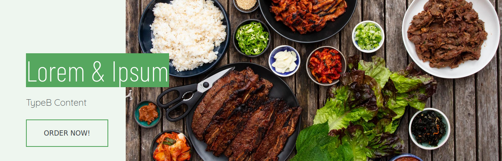
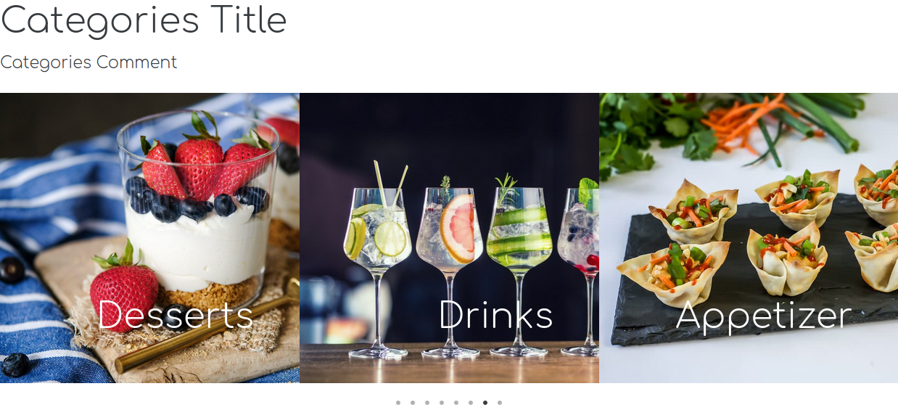
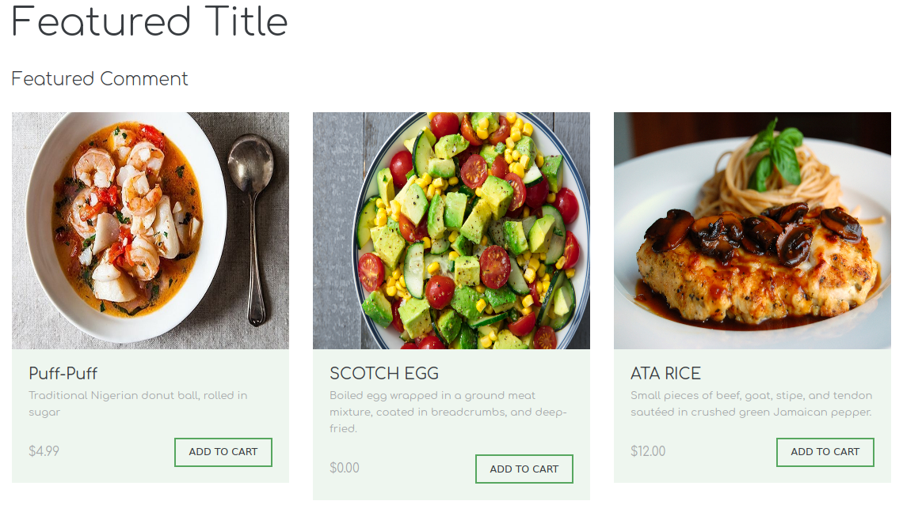
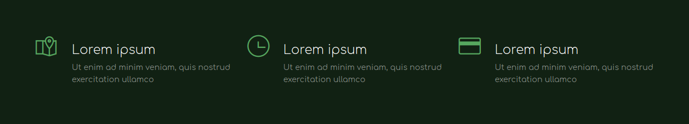

        
  <h3 align="center">Green Theme for TastyIgniter</h3>  

### About the theme

### The Green Extension

### Features
1. Banners
2. Cart as a separate panel.
3. Menu item and Category No-image
4. Single page and form for **Login**, **Register** and **Forgot password**.
5. Welcome Message
6. Notification Banner

---

#### Banners

Three new kinds of banners to add anywhere you want and refactor of **Featured Items** TastyIgniter Banner .

* Main Header
* Categories Slider
* Featured Items
* Steps

* More banners coming soon!.

**Component: bannerComponent**

#### Main Header
Customize:  
1. Title
2. Subtitle
3. Image
4. Button text and URL

  
       

#### Categories Slider
Customize:  
1. Title
2. Subtitle
3. Choose which categories to show/hide. (Component configuration)

  
       

**Important: Requires categories component to work**

### Featured Items
Customize:  
1. Title
2. Subtitle
3. Choose which menu items to show. (Component configuration)

**Recommendation: Use menu items with images**

  
       

### Steps
Customize:  
1. Title
2. Subtitle
3. Create as many steps as you want to display in the banner.
* Main Title, Subtitle and Icon (Font Awesome and Themify Icons supported)

  
       

---

## The Theme

#### Home Page
*Pending add description and information* **Check Images Folder**

#### Menu Page
*Pending add description and information* **Check Images Folder**

#### Checkout Page
*Pending add description and information* **Check Images Folder**

#### Login Page (Register and Forgot password)

#### Account Page
*Pending add description and information* **Check Images Folder**

---

### Welcome Message
Enable it to show a popup message when a new user access your site. **Fixed style**. *Customizable image, text and button text/url*.

---

### Small Changes
**Social Media Icons**
Now you can choose a separate background for each social media icon.

### Contribution
This is a paid theme for TastyIgniter with more features under development. Every 5 purchases the full amount of the theme will be donated to TastyIgniter project.

Price: TBD

### Build with (Pending Update)
Themify Icons (url:themify-icons)  
Slick Slider (url:)

*Next... tastyigniter-red-lite(free) & tastyigniter-red-full(paid) :)*
